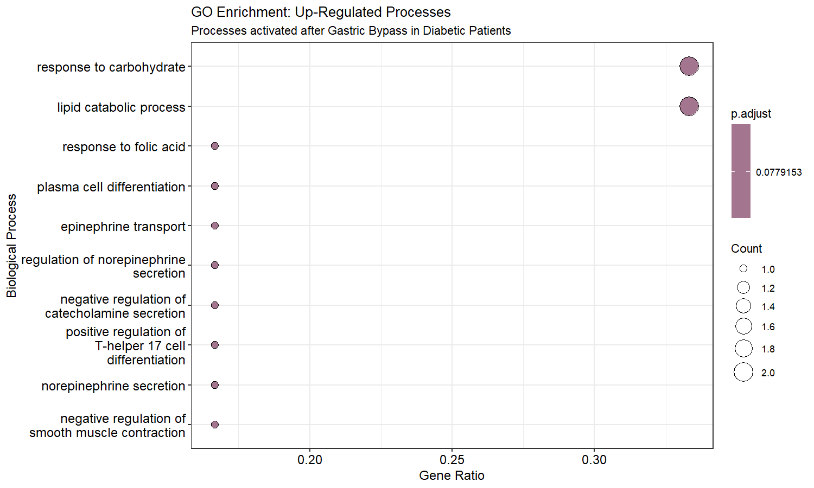
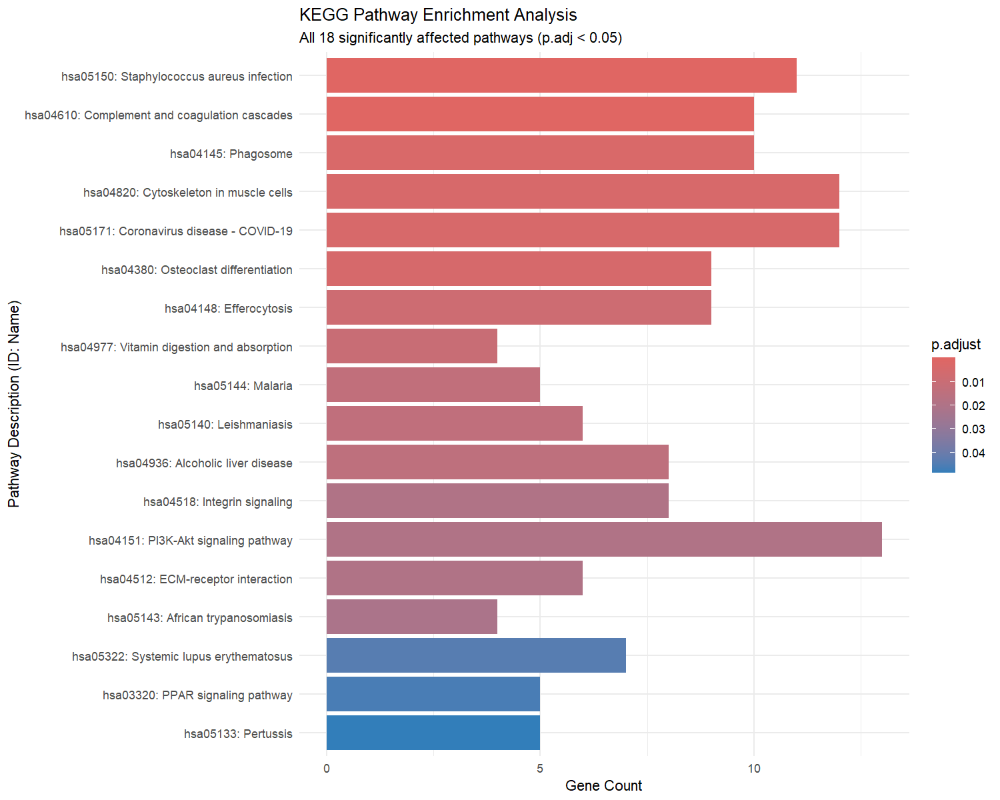
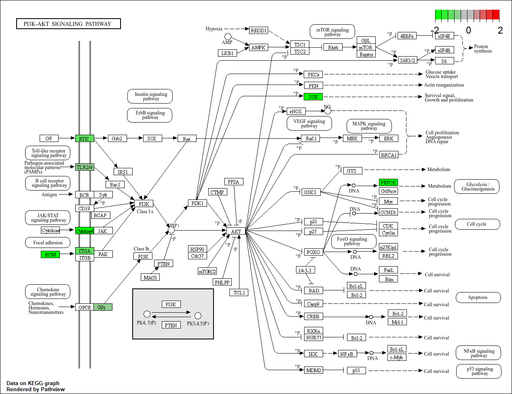
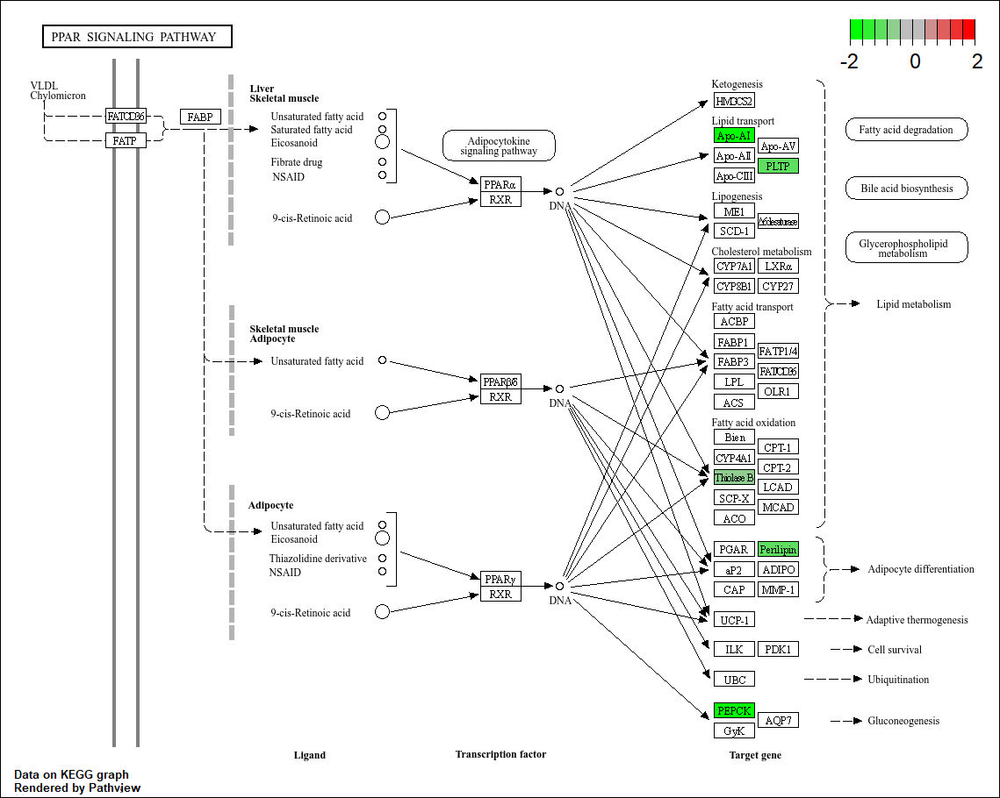

# Analisis Transkriptomik Pasca-Gastric Bypass pada Pasien Diabetes Tipe 2

# 1. Pendahuluan
Operasi _Roux-en-Y Gastric Bypass_ (RYGB) mtidak hanya bertujuan untuk penurunan berat badan, tetapi juga dikenal efektif dalam memperbaiki kontrol glikemik pada pasien Diabetes Mellitus Tipe 2 (DMT2). Meskipun penurunan berat badan berperan penting, mekanisme molekuler yang mendasari perbaikan kontrol glikemik segera setelah operasi masih menjadi subjek penelitian yang intensif. Proyek ini bertujuan untuk mengidentifikasi profil ekspresi gen yang berubah secara signifikan (_Differentially Expressed Genes_) serta memetakan perubahan jalur metabolisme dan pensinyalan seluler pasca-prosedur tersebut.

# 2. Metode
Analisis ini dilakukan menggunakan dataset publik GSE281144 yang diperoleh dari database NCBI Gene Expression Omnibus (GEO). Data ekspresi gen ini dihasilkan menggunakan teknologi microarray pada organisme _Homo sapiens_. 

Analisis profil _Differentially Expressed Genes_ (DEG) dalam proyek ini dilakukan melalui pendekatan komputasional yang sistematis, mencakup tahapan dari pengolahan data mentah hingga interpretasi biologis tingkat lanjut. Secara garis besar, alur kerja dibagi menjadi tiga fase utama:
* Preprocessing
* Analisis Diferensial
* Enrichment Analysis

### 2.1. _Preprocessing data_ 
Proses dimulai dengan pengunduhan dataset GSE281144 dari NCBI GEO. Data diekstraksi dan melalui transformasi Log2 untuk memastikan skala ekspresi gen terdistribusi normal, yang sangat penting untuk analisis statistik parameter metabolik.

### 2.2. _Differential Analysis_
Tahap ini fokus pada pencarian gen spesifik yang ekspresinya berubah drastis akibat perubahan anatomi pencernaan. 
1. Analisis Statistik (Limma) dengan menggunakan model inier untuk mengidentifikasi gen yang memiliki perbedaan ekspresi signifikan pasca-RYGB. Fokus utama adalah mencari gen dengan Adjusted P-Value < 0,05.
2. Menerjemahkan ID Probe teknis menjadi simbol gen (seperti PCK1/PEPCK atau APOA1) agar hasil analisis dapat diinterpretasikan secara klinis dalam konteks biomedis.
3. Visualisasi Volcano Plot untuk menampilkan sebaran gen yang mengalami peningkatan (up-regulated) atau penurunan (down-regulated) ekspresi secara global.
4. Visualisasi Heatmap untuk memberikan visualisasi pola ekspresi gen terpilih antar pasien untuk melihat konsistensi perbaikan metabolisme di tingkat seluler.

### 2.3. _Enrichment Analysis_ (Interpretasi Mekanisme Pemulihan)
Tahap terakhir untuk menerjemahkan daftar gen menjadi narasi biologis mengenai penyembuhan diabetes dengan melakukan pemetaan fungsional menggunakan  database _Gene Ontology_ (GO) untuk pengelompokan gen berdasarkan proses biologisnya dan database _Kyoto Encyclopedia of Genes and Genomes_ (KEGG) untuk identifikasi jalur metabolisme.

# 3. Hasil dan Pembahasan
### 3.1. Volcano Plot Gen yang Terekspresi Diferensial Pasca Roux-en-Y Gastric Bypass

Volcano plot ini menampilkan distribusi gen berdasarkan log₂ fold change (pasca-operasi dibandingkan sebelum operasi) pada sumbu x dan –log₁₀ adjusted p-value pada sumbu y.

Titik berwarna merah merepresentasikan gen yang mengalami peningkatan ekspresi secara signifikan setelah prosedur Roux-en-Y Gastric Bypass, sedangkan titik berwarna biru menunjukkan gen yang mengalami penurunan ekspresi secara signifikan (FDR < 0,05). 

Analisis awal melalui volcano plot menunjukkan adanya pergeseran transkriptomik yang masif pasca-operasi, dengan sejumlah besar gen mengalami penurunan ekspresi yang signifikan.

### 3.2. Heatmap Gen Gen yang Terekspresi Diferensial Pasca Roux-en-Y Gastric Bypass 

Heatmap ini menampilkan 50 gen dengan perubahan ekspresi paling signifikan antara sampel pasien Diabetes Mellitus Tipe 2 sebelum operasi (PreOp_DM) dan setelah operasi (PostOp_DM). Analisis _hierarchical clustering_ menunjukkan pemisahan yang jelas antara kelompok sebelum dan sesudah operasi, menandakan adanya perbedaan pola ekspresi gen yang konsisten antar kelompok.

Skala warna merepresentasikan tingkat ekspresi gen yang telah dinormalisasi menggunakan z-score, di mana warna merah menunjukkan tingkat ekspresi yang lebih tinggi dan warna biru menunjukkan ekspresi yang lebih rendah relatif terhadap rata-rata.

Sejalan dengan hasil analisis volcano plot yang menunjukkan pergeseran transkriptomik yang masif pasca-operasi, heatmap ini memperlihatkan bahwa sampel post-operasi cenderung mengelompok bersama dan menunjukkan pola regulasi gen yang berbeda secara sistematis dibandingkan sampel pre-operasi.

### 3.3. Analisis Fungsional dan Jalur (GO & KEGG)

Analisis Gene Ontology (GO) menunjukkan bahwa gen-gen yang terdampak didominasi oleh proses imunologis dan regulasi homeostasis metabolik. 

Dari 18 jalur KEGG yang signifikan secara statistik, terdapat tiga jalur kunci yang menunjukkan adanya restrukturisasi metabolisme yang signifikan pada pasien diabetes setelah prosedur gastric bypass:

**1.  Modulasi Glukoneogenesis (PI3K-Akt Signaling - hsa04151)**

Pada jalur PI3K-Akt, ditemukan penurunan ekspresi gen PEPCK. Penurunan enzim kunci ini mengindikasikan berkurangnya proses glukoneogenesis (pembentukan gula baru), yang berkontribusi langsung pada penurunan kadar glukosa darah secara sistemik.

**2. Reprogramming Metabolisme Lipid (PPAR Signaling - hsa03320)**

Perubahan pada jalur ini ditandai dengan penurunan ekspresi gen pengangkut lipid seperti Apo-AI dan PLTP. Ditambah dengan adanya penurunan Perilipin menunjukkan adanya adaptasi tubuh dalam memobilisasi dan menyimpan cadangan lemak pasca-operasi. 

**3. Adaptasi Penyerapan Nutrisi (Vitamin Digestion and Absorption - hsa04977)**

Adanya penurunan ekspresi gen transporter mikronutrien, khususnya PCFT dan RFC yang bertanggung jawab atas transportasi folat. Temuan ini memberikan bukti molekuler terhadap risiko malabsorpsi vitamin yang sering diamati secara klinis pada pasien yang telah menjalani bypass usus halus.

# 4. Kesimpulan

Analisis transkriptomik ini mengonfirmasi bahwa efektivitas operasi RYGB dalam mengatasi diabetes melibatkan mekanisme multi-jalur. Selain restrukturisasi respon imun, operasi ini secara spesifik menekan jalur pembentukan gula darah dan mengubah dinamika transportasi nutrisi serta lipid. Temuan ini menegaskan pentingnya manajemen nutrisi pasca-operasi bagi pasien untuk mengantisipasi penurunan penyerapan vitamin.
